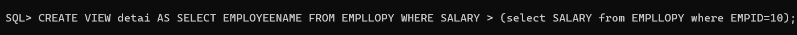
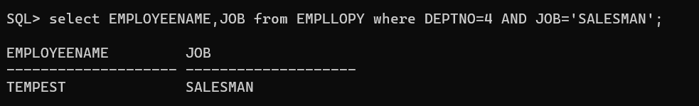
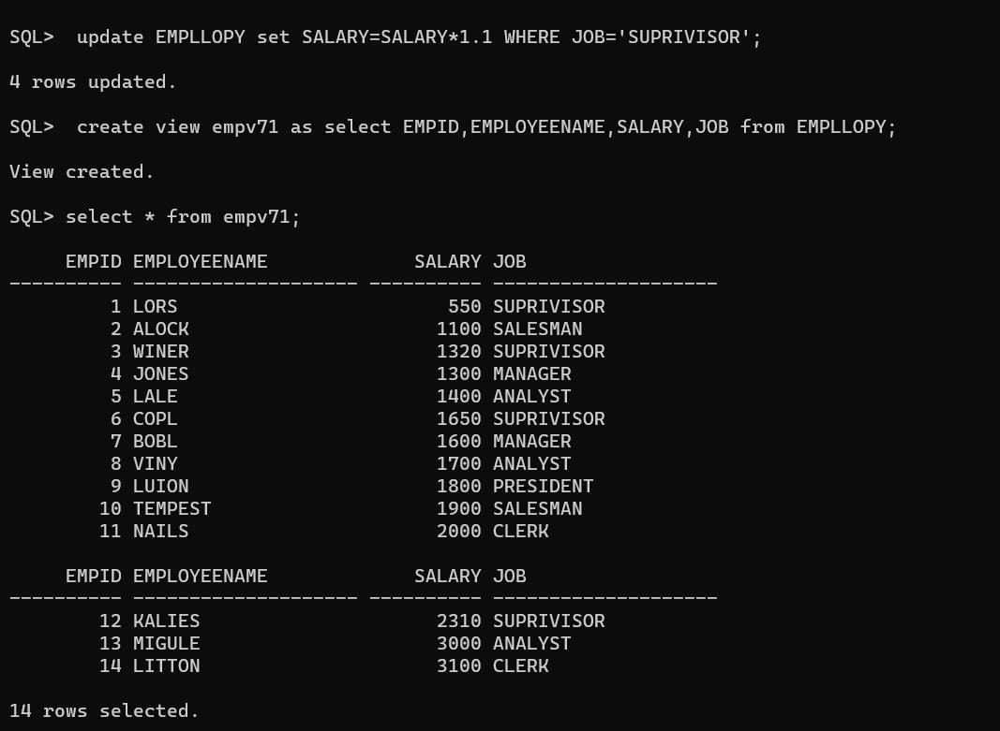

# EX 3 SubQueries, Views and Joins 


## Create employee Table
```
CREATE TABLE EMPLLOPY (EMPID NUMBER(10) PRIMARY KEY,EMPLOYEENAME VARCHAR2(20),JOB VARCHAR2(20),MGR NUMBER(20),HIREDATE DATE,SALARY NUMBER(7,2),COMMISSION NUMBER(7,2),DEPTNO NUMBER(2));
```
## Insert the values
```
INSERT INTO EMPLLOPY (EMPID, EMPLOYEENAME, JOB, MGR, HIREDATE, SALARY, COMMISSION, DEPTNO)
VALUES (1, 'LORS', 'SUPRIVISOR', 111, '17-DEC-80', 500, 600, 1);

INSERT INTO EMPLLOPY (EMPID, EMPLOYEENAME, JOB, MGR, HIREDATE, SALARY, COMMISSION, DEPTNO)
VALUES (2, 'ALOCK', 'SALESMAN', 123, '20-FEB-81', 1100, 700, 3);
INSERT INTO EMPLLOPY (EMPID, EMPLOYEENAME, JOB, MGR, HIREDATE, SALARY, COMMISSION, DEPTNO)
VALUES (3, 'WINER', 'SUPRIVISOR', 112, '22-FEB-81', 1200, 800, 7);
INSERT INTO EMPLLOPY (EMPID, EMPLOYEENAME, JOB, MGR, HIREDATE, SALARY, COMMISSION, DEPTNO)
VALUES (4, 'JONES', 'MANAGER', 113, '02-APR-81', 1300, 900, 5);
INSERT INTO EMPLLOPY (EMPID, EMPLOYEENAME, JOB, MGR, HIREDATE, SALARY, COMMISSION, DEPTNO)
VALUES (5, 'LALE', 'ANALYST', 114, '28-SEP-81', 1400, 1000, 6);
INSERT INTO EMPLLOPY (EMPID, EMPLOYEENAME, JOB, MGR, HIREDATE, SALARY, COMMISSION, DEPTNO)
VALUES (6, 'COPL', 'SUPRIVISOR', 115, '01-MAY-81', 1500, 1100, 7);
INSERT INTO EMPLLOPY (EMPID, EMPLOYEENAME, JOB, MGR, HIREDATE, SALARY, COMMISSION, DEPTNO)
VALUES (7, 'BOBL', 'MANAGER', 116, '09-JUN-81', 1600, 1200, 9);
INSERT INTO EMPLLOPY (EMPID, EMPLOYEENAME, JOB, MGR, HIREDATE, SALARY, COMMISSION, DEPTNO)
VALUES (8, 'VINY', 'ANALYST', 117, '19-APR-87', 1700, 1300, 8);
INSERT INTO EMPLLOPY (EMPID, EMPLOYEENAME, JOB, MGR, HIREDATE, SALARY, COMMISSION, DEPTNO)
VALUES (9, 'LUION', 'PRESIDENT', 118, '17-NOV-81', 1800, 1400, 2);
INSERT INTO EMPLLOPY (EMPID, EMPLOYEENAME, JOB, MGR, HIREDATE, SALARY, COMMISSION, DEPTNO)
VALUES (10, 'TEMPEST', 'SALESMAN', 119, '08-SEP-81', 1900, 1700, 4);
INSERT INTO EMPLLOPY (EMPID, EMPLOYEENAME, JOB, MGR, HIREDATE, SALARY, COMMISSION, DEPTNO)
VALUES (11, 'NAILS', 'CLERK', 120, '23-MAY-87', 2000, 1800, 10);
INSERT INTO EMPLLOPY (EMPID, EMPLOYEENAME, JOB, MGR, HIREDATE, SALARY, COMMISSION, DEPTNO)
VALUES (12, 'KALIES', 'SUPRIVISOR', 121, '03-DEC-81', 2100, 100, 7);
INSERT INTO EMPLLOPY (EMPID, EMPLOYEENAME, JOB, MGR, HIREDATE, SALARY, COMMISSION, DEPTNO)
VALUES (13, 'MIGULE', 'ANALYST', 122, '03-DEC-81', 3000, 200, 8);
INSERT INTO EMPLLOPY (EMPID, EMPLOYEENAME, JOB, MGR, HIREDATE, SALARY, COMMISSION, DEPTNO)
VALUES (14, 'LITTON', 'CLERK', 123, '23-JAN-82',  3100, 300, 9);
```

## Create department table
```
CREATE TABLE DEPARTMENT (DEPARTMENTNUMB NUMBER(2) PRIMARY KEY,DEPARTNAME VARCHAR2(14),LOCICLA VARCHAR2(13));
```
## Insert the values in the department table
```
INSERT INTO DEPARTMENT (DEPARTMENTNUMB, DEPARTNAME, LOCICLA) VALUES (1, 'BIOLOGY', 'LAVA');
INSERT INTO DEPT (DEPTNO, DNAME, LOC) VALUES (2, 'BOTONY', 'JAVA');
INSERT INTO DEPT (DEPTNO, DNAME, LOC) VALUES (3, 'SALES', 'BUTUNO');
INSERT INTO DEPT (DEPTNO, DNAME, LOC) VALUES (4, 'NAVY', 'BYTER');
```

### Q1) List the name of the employees whose salary is greater than that of employee with empno 7566.


### QUERY:
CREATE VIEW detai AS SELECT EMPLOYEENAME FROM EMPLLOPY WHERE SALARY > (select SALARY from EMPLLOPY where EMPID=10);

### OUTPUT:


### Q2) List the ename,job,sal of the employee who get minimum salary in the company.

### QUERY:
CREATE VIEW minimumS AS select EMPLOYEENAME,JOB,SALARY from EMPLLOPY where SALARY =(select MIN(SALARY) from EMPLLOPY);

### OUTPUT:



### Q3) List ename, job of the employees who work in deptno 10 and his/her job is any one of the job in the department ‘SALES’.

### QUERY:
 select EMPLOYEENAME,JOB from EMPLLOPY where DEPTNO=4 AND JOB='SALESMAN;

### OUTPUT:



### Q4) Create a view empv5 (for the table emp) that contains empno, ename, job of the employees who work in dept 10.

### QUERY:
 create view empv8 as select EMPID,EMPLOYEENAME,JOB from EMPLLOPY where DEPTNO=10;

### OUTPUT:


### Q5) Create a view with column aliases empv30 that contains empno, ename, sal of the employees who work in dept 30. Also display the contents of the view.

### QUERY:
create view empv34 AS select EMPID,EMPLOYEENAME, SALARY from EMPLLOPY where DEPTNO=5;


### OUTPUT:


### Q6) Update the view empv5 by increasing 10% salary of the employees who work as ‘CLERK’. Also confirm the modifications in emp table

### QUERY:
 update EMPLLOPY set SALARY=SALARY*1.1 WHERE JOB='SUPRIVISOR;
 create view empv71 as select EMPID,EMPLOYEENAME,SALARY,JOB from EMPLLOPY;

### OUTPUT:


## Create a CUSTMWE Table
```
CREATE TABLE CUSTMWE (ID INT,NAMES VARCHAR(20),city VARCHAR(20),grade INT,salesman_id INT);
```
## Inserting Values to the Table
```
INSERT INTO CUSTMWE (ID, NAMES, city, grade, salesman_id) VALUES(3002, ' KIRMADA', ' URANUS', 400, 1);
INSERT INTO CUSTMWE (ID, NAMES, city, grade, salesman_id) VALUES(3007, ' JENA', 'PLUTO ', 300, 2);
INSERT INTO CUSTMWE (ID, NAMES, city, grade, salesman_id) VALUES(3005, 'VILTE ', 'EARTH', 200, 3);
INSERT INTO CUSTMWE (ID, NAMES, city, grade, salesman_id) VALUES(3008, 'GOST ', 'VENUS', 300, 4);
INSERT INTO CUSTMWE (ID, NAMES, city, grade, salesman_id) VALUES(3004, 'LUBU ', 'JUPITER', 300, 5);
INSERT INTO CUSTMWE (ID, NAMES, city, grade, salesman_id) VALUES(3009, 'GRED ', 'SUN', 100, 6);
INSERT INTO CUSTMWE (ID, NAMES, city, grade, salesman_id) VALUES(3003, ' TALE', 'SATURN', 200, 7);
INSERT INTO CUSTMWE (ID, NAMES, city, grade, salesman_id) VALUES(3001, ' DON', 'MERCURY', 600, 8);
```
## Create a CLINT table
```sql
CREATE TABLE CLINTI (salesman_id INT,name VARCHAR(20),city VARCHAR(20),commission DECIMAL(4,2));
```
## Inserting Values to the Table
```
INSERT INTO CLINTI (salesman_id, name, city, commission) VALUES(5001, 'LABU', 'URANUS', 0.9);
INSERT INTO CLINTI (salesman_id, name, city, commission) VALUES(5002, 'USTER', 'PLUTO', 0.7);
INSERT INTO CLINTI (salesman_id, name, city, commission) VALUES(5005, 'IDGOT', 'EARTH', 0.7);
INSERT INTO CLINTI (salesman_id, name, city, commission) VALUES(5006, 'AISTENE', 'VENUS', 0.6);
INSERT INTO CLINTI (salesman_id, name, city, commission) VALUES(5007, 'ALOCK', 'JUPITER', 0.4);
INSERT INTO CLINTI (salesman_id, name, city, commission) VALUES(5003, ' LOPUYT', ' SUN', 0.5);
```
### Q7) Write a SQL query to find the salesperson and customer who reside in the same city. Return Salesman, cust_name and city.

### QUERY:
select s.name,c.cust_name,s.city from CLINTI as s,CUSTMWE as c where s.city=c.city;

### OUTPUT:


### Q8) Write a SQL query to find salespeople who received commissions of more than 13 percent from the company. Return Customer Name, customer city, Salesman, commission.


### QUERY:
select CLINTI.name,CUSTMWE.NAMES,CLINTI.city,CLINTI.commission from CLINTI as CLINTI inner join CUSTMWE as CUSTMWE on CLINTI.city
where CLINTI.commission>0.13;

### OUTPUT:


### Q9) Perform Natural join on both tables

### QUERY:
select s.name,c.cust_name,s.city,s.commission from salesman? as s natural join customer as ¢c where
s.commission>0.13;

### OUTPUT:


### Q10) Perform Left and right join on both tables


### QUERY:
select s.name,c.cust_name,s.city,s.commission from salesman as s left join customer1 as ¢ on
s.salesman_id=c.salesman_id where s.commission>0.13; select s.name,c.cust_name,s.city,s.commission
from salesman as s right join customer? as ¢ on s.salesman_id=c.salesman_id where
s.commission>0.13;

### OUTPUT:


### RESULT :
Hence successfully created a manager database and executed views and joins using SQL.
